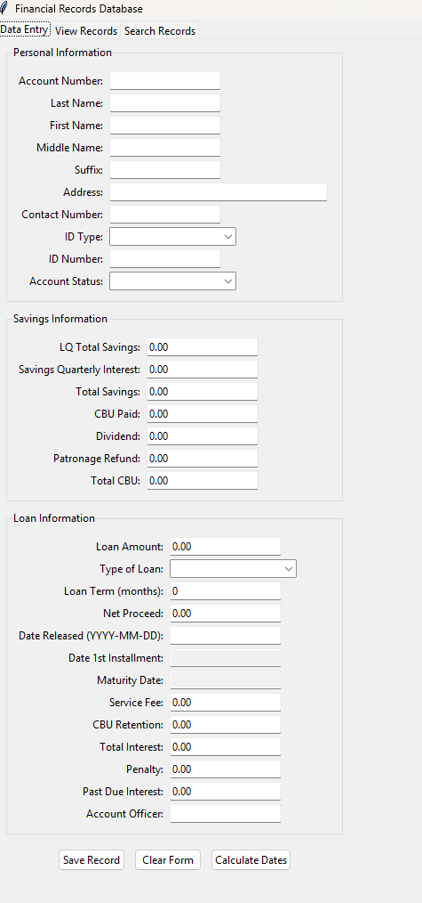
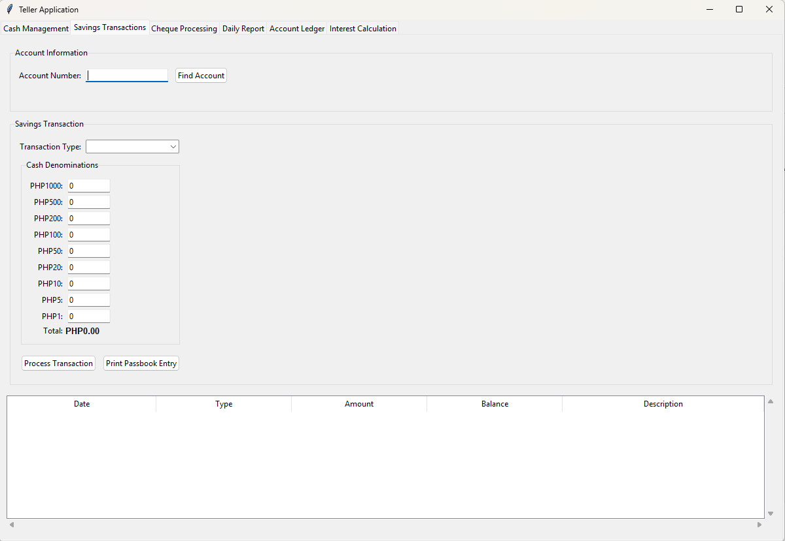
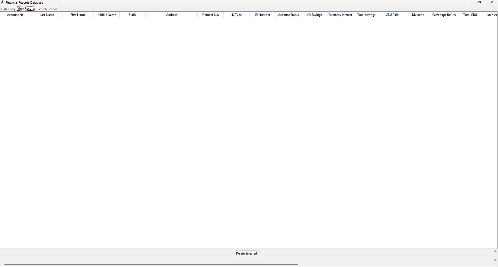
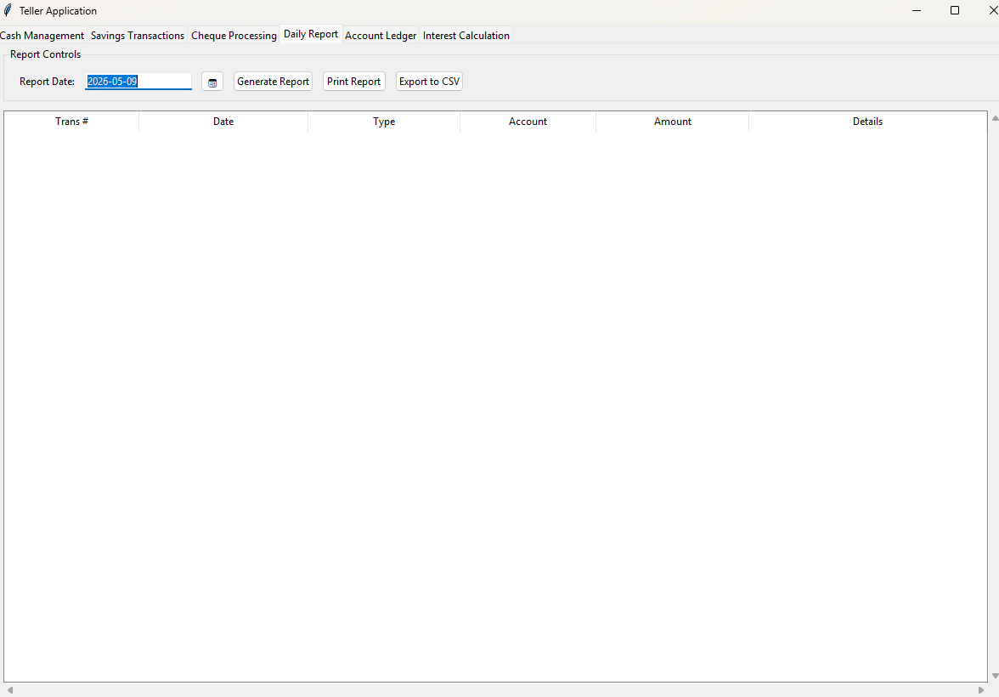
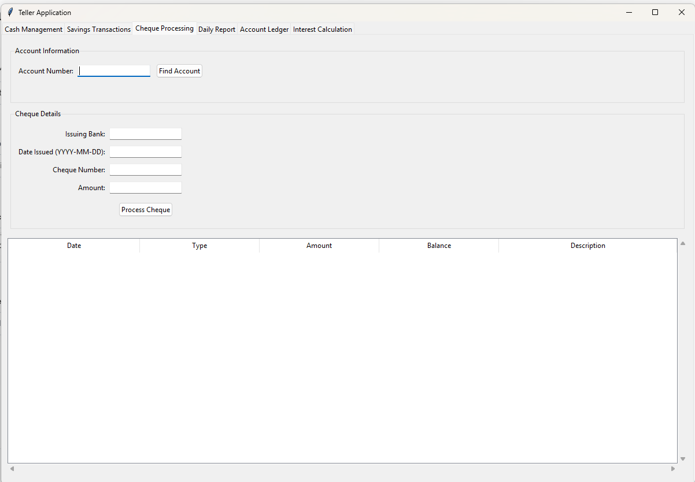
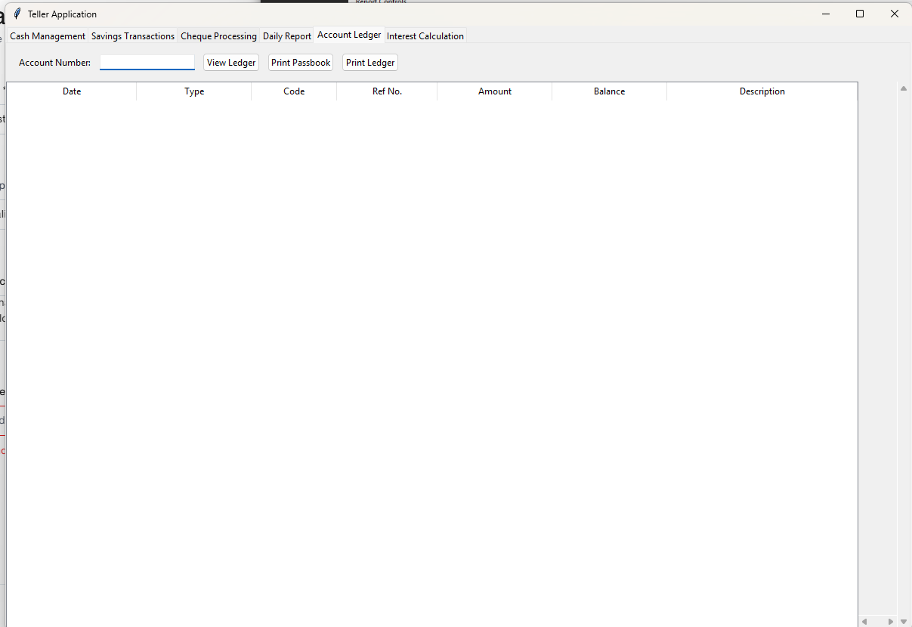
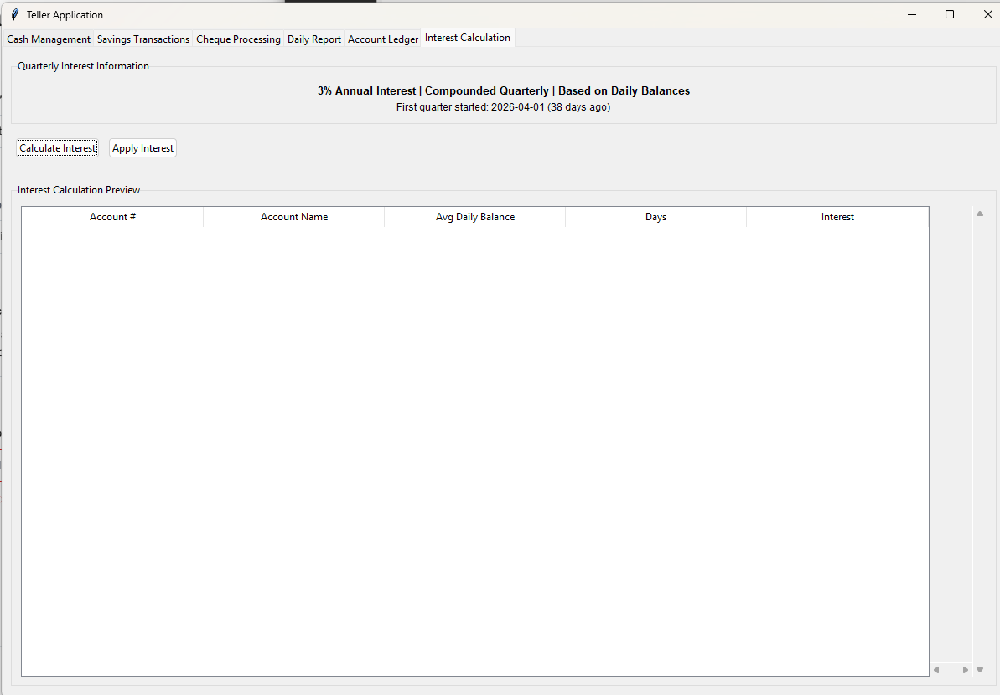

# Cooperative Banking System Prototype

An independent prototype teller system for cooperative banking operations: member
account management, cash/savings transactions with denomination breakdown, cheque
processing, daily reporting, and interest calculation. Built with Python/Tkinter and
SQLite, modeled on real cooperative teller workflows but built as a standalone
exploration, not a SAMCO production system.

- `DATA_BASE_CREATION_GUI_with_editfunction.py` — account/member data entry and edit tool
- `TELLER-SAVINGS_DEPOSIT_WITHDRAWAL.py` — teller application: cash management, savings
  transactions with denomination counting, cheque processing, daily reports, interest
  calculation
- `SAMCO FINANCIAL BANKING SYSTEM.docx` / `..._REFINED.docx` — the design spec this was
  built from: user roles, account types, and module breakdown

## Screenshots

## Note on data

This is an independent/portfolio project — no real member or transaction data. Forms
shown above are blank/demo state.
