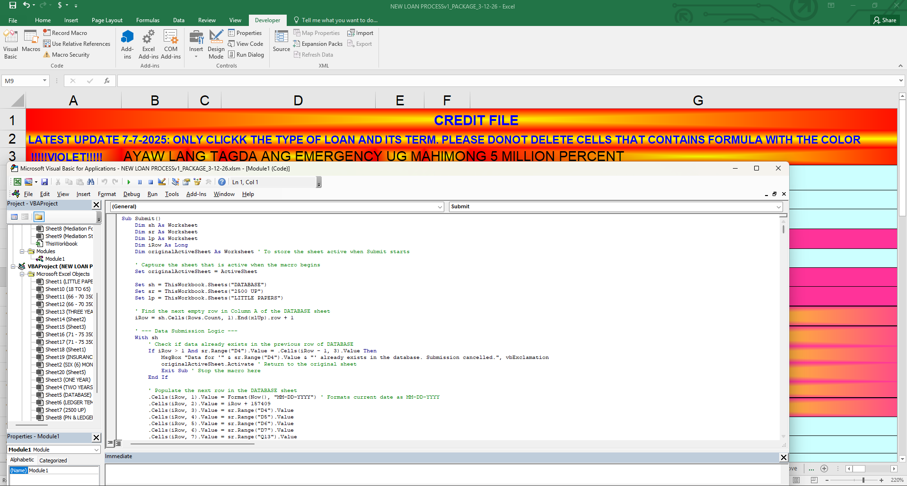

# Loan Processing & Insurance Automation System

Production VBA/Excel platform handling amortization schedules, interest calculations,
Loan Payment Protection Insurance (LPPI) computation, payment tracking, and promissory
note generation for 7,000+ loan accounts. Live in daily production since 2022.

The live workbook is not included here, as it contains confidential member and
financial data. See the resume/portfolio overview in this repo for a full write-up
of the system's design and impact.

## Screenshots

Member/loan detail redacted before capture:

